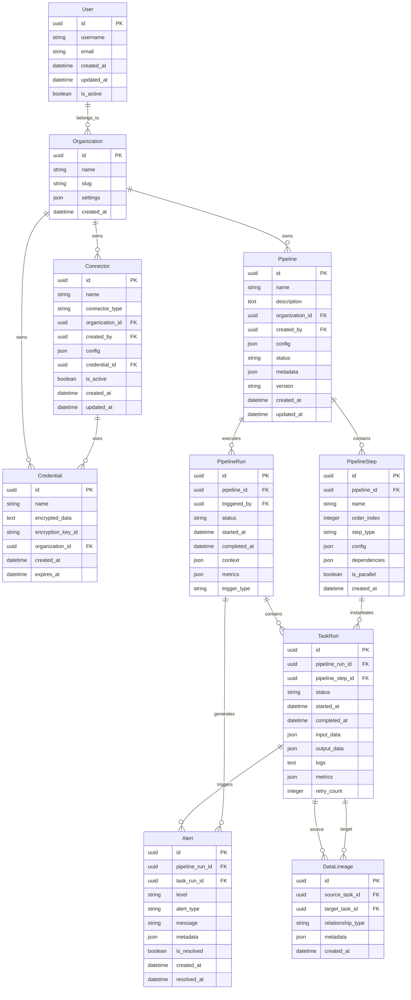

# Modèle de Données - Django ETL Platform

## Schema de base de données

### Vue d'ensemble

Le modèle de données suit les principes de normalisation tout en optimisant les performances pour les opérations ETL. La conception privilégie la traçabilité, l'auditabilité et la scalabilité.

## Diagramme ERD



## Modèles Django détaillés

### 1. Core Models

#### User (Extension de AbstractUser)
```python
from django.contrib.auth.models import AbstractUser
from django.db import models
import uuid

class User(AbstractUser):
    id = models.UUIDField(primary_key=True, default=uuid.uuid4)
    organizations = models.ManyToManyField(
        'Organization', 
        through='OrganizationMembership'
    )
    preferences = models.JSONField(default=dict)
    last_login_ip = models.GenericIPAddressField(null=True)
    
    class Meta:
        db_table = 'auth_user'
        indexes = [
            models.Index(fields=['email']),
            models.Index(fields=['username']),
        ]
```

#### Organization
```python
class Organization(models.Model):
    id = models.UUIDField(primary_key=True, default=uuid.uuid4)
    name = models.CharField(max_length=255)
    slug = models.SlugField(unique=True)
    settings = models.JSONField(default=dict)
    created_at = models.DateTimeField(auto_now_add=True)
    updated_at = models.DateTimeField(auto_now=True)
    
    class Meta:
        db_table = 'organizations'
        ordering = ['name']
```

### 2. Connector Models

#### Connector
```python
class ConnectorType(models.TextChoices):
    DATABASE = 'database', 'Database'
    API = 'api', 'API'
    FILE = 'file', 'File'
    CLOUD = 'cloud', 'Cloud Storage'

class Connector(models.Model):
    id = models.UUIDField(primary_key=True, default=uuid.uuid4)
    name = models.CharField(max_length=255)
    connector_type = models.CharField(max_length=50, choices=ConnectorType.choices)
    organization = models.ForeignKey(Organization, on_delete=models.CASCADE)
    created_by = models.ForeignKey(User, on_delete=models.PROTECT)
    config = models.JSONField()  # Configuration spécifique au type
    credential = models.ForeignKey('Credential', on_delete=models.PROTECT)
    is_active = models.BooleanField(default=True)
    created_at = models.DateTimeField(auto_now_add=True)
    updated_at = models.DateTimeField(auto_now=True)
    
    class Meta:
        db_table = 'connectors'
        indexes = [
            models.Index(fields=['organization', 'connector_type']),
            models.Index(fields=['is_active']),
        ]
        constraints = [
            models.UniqueConstraint(
                fields=['organization', 'name'],
                name='unique_connector_name_per_org'
            )
        ]
```

#### Credential
```python
from cryptography.fernet import Fernet

class Credential(models.Model):
    id = models.UUIDField(primary_key=True, default=uuid.uuid4)
    name = models.CharField(max_length=255)
    encrypted_data = models.TextField()
    encryption_key_id = models.CharField(max_length=255)
    organization = models.ForeignKey(Organization, on_delete=models.CASCADE)
    created_at = models.DateTimeField(auto_now_add=True)
    expires_at = models.DateTimeField(null=True, blank=True)
    
    def encrypt_data(self, data: dict) -> None:
        """Chiffre les données sensibles"""
        key = self.get_encryption_key()
        fernet = Fernet(key)
        self.encrypted_data = fernet.encrypt(
            json.dumps(data).encode()
        ).decode()
    
    def decrypt_data(self) -> dict:
        """Déchiffre les données"""
        key = self.get_encryption_key()
        fernet = Fernet(key)
        return json.loads(
            fernet.decrypt(self.encrypted_data.encode()).decode()
        )
    
    class Meta:
        db_table = 'credentials'
```

### 3. Pipeline Models

#### Pipeline
```python
class PipelineStatus(models.TextChoices):
    DRAFT = 'draft', 'Draft'
    ACTIVE = 'active', 'Active'
    PAUSED = 'paused', 'Paused'
    DEPRECATED = 'deprecated', 'Deprecated'

class Pipeline(models.Model):
    id = models.UUIDField(primary_key=True, default=uuid.uuid4)
    name = models.CharField(max_length=255)
    description = models.TextField(blank=True)
    organization = models.ForeignKey(Organization, on_delete=models.CASCADE)
    created_by = models.ForeignKey(User, on_delete=models.PROTECT)
    config = models.JSONField()  # Configuration du pipeline (scheduling, etc.)
    status = models.CharField(max_length=20, choices=PipelineStatus.choices)
    metadata = models.JSONField(default=dict)  # Tags, catégories, etc.
    version = models.CharField(max_length=50, default='1.0.0')
    created_at = models.DateTimeField(auto_now_add=True)
    updated_at = models.DateTimeField(auto_now=True)
    
    class Meta:
        db_table = 'pipelines'
        indexes = [
            models.Index(fields=['organization', 'status']),
            models.Index(fields=['created_by']),
        ]
```

#### PipelineStep
```python
class StepType(models.TextChoices):
    EXTRACT = 'extract', 'Extract'
    TRANSFORM = 'transform', 'Transform'
    LOAD = 'load', 'Load'
    VALIDATE = 'validate', 'Validate'
    NOTIFY = 'notify', 'Notify'

class PipelineStep(models.Model):
    id = models.UUIDField(primary_key=True, default=uuid.uuid4)
    pipeline = models.ForeignKey(Pipeline, on_delete=models.CASCADE, related_name='steps')
    name = models.CharField(max_length=255)
    order_index = models.PositiveIntegerField()
    step_type = models.CharField(max_length=50, choices=StepType.choices)
    config = models.JSONField()
    dependencies = models.JSONField(default=list)  # IDs des steps prérequises
    is_parallel = models.BooleanField(default=False)
    created_at = models.DateTimeField(auto_now_add=True)
    
    class Meta:
        db_table = 'pipeline_steps'
        ordering = ['order_index']
        indexes = [
            models.Index(fields=['pipeline', 'order_index']),
        ]
        constraints = [
            models.UniqueConstraint(
                fields=['pipeline', 'order_index'],
                name='unique_step_order_per_pipeline'
            )
        ]
```

### 4. Execution Models

#### PipelineRun
```python
class RunStatus(models.TextChoices):
    PENDING = 'pending', 'Pending'
    RUNNING = 'running', 'Running'
    SUCCESS = 'success', 'Success'
    FAILED = 'failed', 'Failed'
    CANCELLED = 'cancelled', 'Cancelled'
    TIMEOUT = 'timeout', 'Timeout'

class TriggerType(models.TextChoices):
    MANUAL = 'manual', 'Manual'
    SCHEDULED = 'scheduled', 'Scheduled'
    API = 'api', 'API'
    WEBHOOK = 'webhook', 'Webhook'

class PipelineRun(models.Model):
    id = models.UUIDField(primary_key=True, default=uuid.uuid4)
    pipeline = models.ForeignKey(Pipeline, on_delete=models.CASCADE)
    triggered_by = models.ForeignKey(User, on_delete=models.PROTECT, null=True)
    status = models.CharField(max_length=20, choices=RunStatus.choices, default=RunStatus.PENDING)
    started_at = models.DateTimeField(auto_now_add=True)
    completed_at = models.DateTimeField(null=True, blank=True)
    context = models.JSONField(default=dict)  # Variables d'environnement
    metrics = models.JSONField(default=dict)  # Métriques de performance
    trigger_type = models.CharField(max_length=20, choices=TriggerType.choices)
    
    @property
    def duration(self):
        if self.completed_at and self.started_at:
            return self.completed_at - self.started_at
        return None
    
    class Meta:
        db_table = 'pipeline_runs'
        indexes = [
            models.Index(fields=['pipeline', '-started_at']),
            models.Index(fields=['status']),
            models.Index(fields=['triggered_by']),
        ]
```

#### TaskRun
```python
class TaskRun(models.Model):
    id = models.UUIDField(primary_key=True, default=uuid.uuid4)
    pipeline_run = models.ForeignKey(PipelineRun, on_delete=models.CASCADE, related_name='task_runs')
    pipeline_step = models.ForeignKey(PipelineStep, on_delete=models.PROTECT)
    status = models.CharField(max_length=20, choices=RunStatus.choices, default=RunStatus.PENDING)
    started_at = models.DateTimeField(null=True, blank=True)
    completed_at = models.DateTimeField(null=True, blank=True)
    input_data = models.JSONField(null=True, blank=True)
    output_data = models.JSONField(null=True, blank=True)
    logs = models.TextField(blank=True)
    metrics = models.JSONField(default=dict)
    retry_count = models.PositiveIntegerField(default=0)
    
    class Meta:
        db_table = 'task_runs'
        indexes = [
            models.Index(fields=['pipeline_run', 'status']),
            models.Index(fields=['pipeline_step']),
            models.Index(fields=['-started_at']),
        ]
```

### 5. Monitoring Models

#### Alert
```python
class AlertLevel(models.TextChoices):
    INFO = 'info', 'Info'
    WARNING = 'warning', 'Warning'
    ERROR = 'error', 'Error'
    CRITICAL = 'critical', 'Critical'

class AlertType(models.TextChoices):
    TASK_FAILED = 'task_failed', 'Task Failed'
    PIPELINE_FAILED = 'pipeline_failed', 'Pipeline Failed'
    PERFORMANCE_DEGRADATION = 'performance_degradation', 'Performance Degradation'
    RESOURCE_EXHAUSTION = 'resource_exhaustion', 'Resource Exhaustion'
    DATA_QUALITY = 'data_quality', 'Data Quality'

class Alert(models.Model):
    id = models.UUIDField(primary_key=True, default=uuid.uuid4)
    pipeline_run = models.ForeignKey(PipelineRun, on_delete=models.CASCADE, null=True)
    task_run = models.ForeignKey(TaskRun, on_delete=models.CASCADE, null=True)
    level = models.CharField(max_length=20, choices=AlertLevel.choices)
    alert_type = models.CharField(max_length=50, choices=AlertType.choices)
    message = models.TextField()
    metadata = models.JSONField(default=dict)
    is_resolved = models.BooleanField(default=False)
    created_at = models.DateTimeField(auto_now_add=True)
    resolved_at = models.DateTimeField(null=True, blank=True)
    
    class Meta:
        db_table = 'alerts'
        indexes = [
            models.Index(fields=['level', '-created_at']),
            models.Index(fields=['is_resolved']),
            models.Index(fields=['alert_type']),
        ]
```

### 6. Data Lineage Model

#### DataLineage
```python
class RelationshipType(models.TextChoices):
    DIRECT = 'direct', 'Direct'
    DERIVED = 'derived', 'Derived'
    AGGREGATED = 'aggregated', 'Aggregated'
    FILTERED = 'filtered', 'Filtered'

class DataLineage(models.Model):
    id = models.UUIDField(primary_key=True, default=uuid.uuid4)
    source_task = models.ForeignKey(TaskRun, on_delete=models.CASCADE, related_name='lineage_as_source')
    target_task = models.ForeignKey(TaskRun, on_delete=models.CASCADE, related_name='lineage_as_target')
    relationship_type = models.CharField(max_length=20, choices=RelationshipType.choices)
    metadata = models.JSONField(default=dict)  # Colonnes, transformations appliquées
    created_at = models.DateTimeField(auto_now_add=True)
    
    class Meta:
        db_table = 'data_lineage'
        constraints = [
            models.UniqueConstraint(
                fields=['source_task', 'target_task'],
                name='unique_lineage_relationship'
            )
        ]
```

## Optimisations et indexes

### Partitioning par date
```sql
-- Partitioning pour TaskRun par mois
CREATE TABLE task_runs_partition (
    LIKE task_runs INCLUDING ALL
) PARTITION BY RANGE (started_at);

CREATE TABLE task_runs_y2025m01 PARTITION OF task_runs_partition
FOR VALUES FROM ('2025-01-01') TO ('2025-02-01');
```

### Indexes composites
```python
class Meta:
    indexes = [
        # Index pour dashboard performance
        models.Index(
            fields=['pipeline', '-started_at', 'status'],
            name='pipeline_runs_dashboard_idx'
        ),
        # Index pour recherche par date
        models.Index(
            fields=['started_at', 'status'],
            condition=models.Q(status__in=['running', 'pending']),
            name='active_runs_idx'
        ),
    ]
```

## Migration strategy

### Versioning schema
- Chaque migration a un numéro de version
- Support rollback automatique
- Validation des contraintes avant migration
- Backup automatique des données critiques

### Performance considerations
- Indexes créés en mode CONCURRENT
- Migrations chunked pour gros volumes
- Monitoring des performances pendant migration
