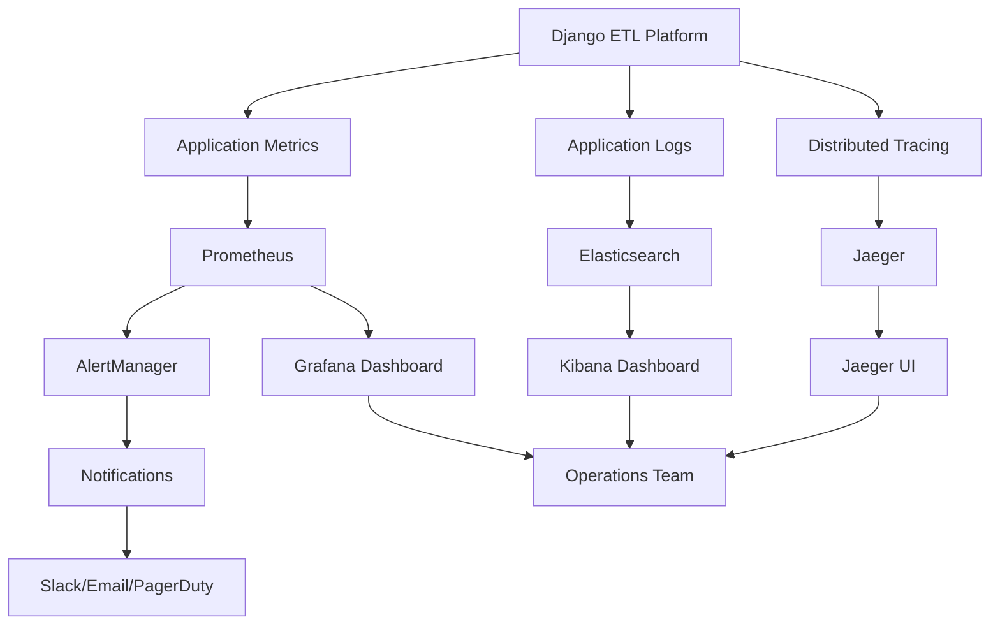

# Monitoring et Observabilité - Django ETL Platform

## Vue d'ensemble

L'observabilité est cruciale pour une plateforme ETL en production. Elle permet de surveiller les performances, détecter les anomalies, et diagnostiquer rapidement les problèmes. Notre approche suit les trois piliers de l'observabilité : logs, métriques, et traces.

## Architecture de monitoring



## Métriques et instrumentation

### Métriques applicatives

```python
# monitoring/metrics.py
from prometheus_client import Counter, Histogram, Gauge, Info
import time
import functools
from typing import Dict, Any
import logging

# Métriques système
PIPELINE_EXECUTIONS_TOTAL = Counter(
    'pipeline_executions_total',
    'Total number of pipeline executions',
    ['pipeline_name', 'status', 'organization']
)

PIPELINE_EXECUTION_DURATION = Histogram(
    'pipeline_execution_duration_seconds',
    'Pipeline execution duration in seconds',
    ['pipeline_name', 'organization'],
    buckets=[1, 5, 10, 30, 60, 300, 600, 1800, 3600]
)

TASK_EXECUTIONS_TOTAL = Counter(
    'task_executions_total',
    'Total number of task executions',
    ['task_type', 'status', 'pipeline_name']
)

ACTIVE_PIPELINE_RUNS = Gauge(
    'active_pipeline_runs',
    'Number of currently running pipelines'
)

DATA_ROWS_PROCESSED = Counter(
    'data_rows_processed_total',
    'Total number of data rows processed',
    ['pipeline_name', 'step_type']
)

DATABASE_CONNECTIONS_ACTIVE = Gauge(
    'database_connections_active',
    'Number of active database connections',
    ['database_type']
)

CONNECTOR_OPERATIONS_TOTAL = Counter(
    'connector_operations_total',
    'Total connector operations',
    ['connector_type', 'operation', 'status']
)

QUEUE_SIZE = Gauge(
    'celery_queue_size',
    'Size of Celery queues',
    ['queue_name']
)

# Informations sur l'application
APP_INFO = Info(
    'etl_platform_info',
    'Information about the ETL platform'
)

class MetricsCollector:
    """Collecteur centralisé de métriques"""
    
    def __init__(self):
        self.logger = logging.getLogger(__name__)
        # Initialiser les informations de l'application
        APP_INFO.info({
            'version': self._get_app_version(),
            'environment': self._get_environment(),
            'build_date': self._get_build_date()
        })
    
    def record_pipeline_execution(self, pipeline_name: str, organization: str, 
                                 status: str, duration: float):
        """Enregistre une exécution de pipeline"""
        PIPELINE_EXECUTIONS_TOTAL.labels(
            pipeline_name=pipeline_name,
            status=status,
            organization=organization
        ).inc()
        
        if status == 'success':
            PIPELINE_EXECUTION_DURATION.labels(
                pipeline_name=pipeline_name,
                organization=organization
            ).observe(duration)
    
    def record_task_execution(self, task_type: str, pipeline_name: str, 
                             status: str, rows_processed: int = 0):
        """Enregistre une exécution de tâche"""
        TASK_EXECUTIONS_TOTAL.labels(
            task_type=task_type,
            status=status,
            pipeline_name=pipeline_name
        ).inc()
        
        if rows_processed > 0:
            DATA_ROWS_PROCESSED.labels(
                pipeline_name=pipeline_name,
                step_type=task_type
            ).inc(rows_processed)
    
    def record_connector_operation(self, connector_type: str, 
                                  operation: str, status: str):
        """Enregistre une opération de connecteur"""
        CONNECTOR_OPERATIONS_TOTAL.labels(
            connector_type=connector_type,
            operation=operation,
            status=status
        ).inc()
    
    def update_active_runs(self, count: int):
        """Met à jour le nombre d'exécutions actives"""
        ACTIVE_PIPELINE_RUNS.set(count)
    
    def update_queue_sizes(self, queue_sizes: Dict[str, int]):
        """Met à jour les tailles des queues"""
        for queue_name, size in queue_sizes.items():
            QUEUE_SIZE.labels(queue_name=queue_name).set(size)
    
    def update_db_connections(self, db_connections: Dict[str, int]):
        """Met à jour le nombre de connexions DB"""
        for db_type, count in db_connections.items():
            DATABASE_CONNECTIONS_ACTIVE.labels(database_type=db_type).set(count)
    
    def _get_app_version(self) -> str:
        """Récupère la version de l'application"""
        try:
            with open('VERSION', 'r') as f:
                return f.read().strip()
        except FileNotFoundError:
            return 'unknown'
    
    def _get_environment(self) -> str:
        """Récupère l'environnement actuel"""
        import os
        return os.getenv('ENVIRONMENT', 'development')
    
    def _get_build_date(self) -> str:
        """Récupère la date de build"""
        import os
        return os.getenv('BUILD_DATE', 'unknown')

# Instance globale
metrics_collector = MetricsCollector()

# Decorator pour instrumenter automatiquement
def monitor_execution(metric_name: str = None):
    """Decorator pour surveiller l'exécution des fonctions"""
    def decorator(func):
        @functools.wraps(func)
        def wrapper(*args, **kwargs):
            start_time = time.time()
            status = 'success'
            
            try:
                result = func(*args, **kwargs)
                return result
            except Exception as e:
                status = 'error'
                logging.error(f"Function {func.__name__} failed: {e}")
                raise
            finally:
                duration = time.time() - start_time
                
                # Enregistrer la métrique
                function_name = metric_name or func.__name__
                PIPELINE_EXECUTION_DURATION.labels(
                    pipeline_name=function_name,
                    organization='system'
                ).observe(duration)
                
                logging.info(f"Function {func.__name__} executed in {duration:.2f}s with status {status}")
        
        return wrapper
    return decorator
```

### Middleware de monitoring

```python
# monitoring/middleware.py
import time
import logging
from django.utils.deprecation import MiddlewareMixin
from django.db import connection
from prometheus_client import Counter, Histogram
from .metrics import metrics_collector

# Métriques HTTP
HTTP_REQUESTS_TOTAL = Counter(
    'http_requests_total',
    'Total HTTP requests',
    ['method', 'endpoint', 'status_code']
)

HTTP_REQUEST_DURATION = Histogram(
    'http_request_duration_seconds',
    'HTTP request duration',
    ['method', 'endpoint'],
    buckets=[0.01, 0.05, 0.1, 0.25, 0.5, 1.0, 2.5, 5.0, 10.0]
)

class MonitoringMiddleware(MiddlewareMixin):
    """Middleware pour surveiller les requêtes HTTP"""
    
    def __init__(self, get_response):
        super().__init__(get_response)
        self.get_response = get_response
        self.logger = logging.getLogger(__name__)
    
    def __call__(self, request):
        start_time = time.time()
        
        # Compter les requêtes DB avant
        queries_before = len(connection.queries)
        
        response = self.get_response(request)
        
        # Calculer les métriques
        duration = time.time() - start_time
        queries_count = len(connection.queries) - queries_before
        endpoint = self._get_endpoint_name(request)
        
        # Enregistrer les métriques
        HTTP_REQUESTS_TOTAL.labels(
            method=request.method,
            endpoint=endpoint,
            status_code=response.status_code
        ).inc()
        
        HTTP_REQUEST_DURATION.labels(
            method=request.method,
            endpoint=endpoint
        ).observe(duration)
        
        # Logger les requêtes lentes
        if duration > 1.0:  # Plus d'1 seconde
            self.logger.warning(
                "Slow request detected",
                extra={
                    'path': request.path,
                    'method': request.method,
                    'duration': duration,
                    'db_queries': queries_count,
                    'status_code': response.status_code,
                    'user_id': getattr(request.user, 'id', None)
                }
            )
        
        # Logger trop de requêtes DB
        if queries_count > 10:
            self.logger.warning(
                "High DB query count",
                extra={
                    'path': request.path,
                    'queries_count': queries_count,
                    'duration': duration
                }
            )
        
        return response
    
    def _get_endpoint_name(self, request):
        """Extrait le nom de l'endpoint normalisé"""
        resolver_match = getattr(request, 'resolver_match', None)
        if resolver_match:
            return f"{resolver_match.app_name}:{resolver_match.url_name}"
        return request.path
```

### Monitoring des tâches Celery

```python
# monitoring/celery_monitoring.py
from celery.signals import (
    task_prerun, task_postrun, task_failure, task_retry,
    worker_ready, worker_shutdown
)
import time
import logging
from .metrics import metrics_collector

logger = logging.getLogger(__name__)

# Variables globales pour tracking
task_start_times = {}

@task_prerun.connect
def task_prerun_handler(sender=None, task_id=None, task=None, args=None, kwargs=None, **kwds):
    """Handler appelé avant l'exécution d'une tâche"""
    task_start_times[task_id] = time.time()
    
    logger.info(
        "Task started",
        extra={
            'task_id': task_id,
            'task_name': task.name,
            'args': str(args),
            'kwargs': str(kwargs)
        }
    )

@task_postrun.connect
def task_postrun_handler(sender=None, task_id=None, task=None, args=None, 
                        kwargs=None, retval=None, state=None, **kwds):
    """Handler appelé après l'exécution d'une tâche"""
    start_time = task_start_times.pop(task_id, time.time())
    duration = time.time() - start_time
    
    # Extraire des métadonnées de la tâche
    task_type = _extract_task_type(task.name)
    pipeline_name = _extract_pipeline_name(kwargs)
    
    # Enregistrer les métriques
    metrics_collector.record_task_execution(
        task_type=task_type,
        pipeline_name=pipeline_name,
        status='success' if state == 'SUCCESS' else 'error'
    )
    
    logger.info(
        "Task completed",
        extra={
            'task_id': task_id,
            'task_name': task.name,
            'duration': duration,
            'state': state,
            'result_size': len(str(retval)) if retval else 0
        }
    )

@task_failure.connect
def task_failure_handler(sender=None, task_id=None, exception=None, 
                        traceback=None, einfo=None, **kwds):
    """Handler appelé en cas d'échec de tâche"""
    start_time = task_start_times.pop(task_id, time.time())
    duration = time.time() - start_time
    
    logger.error(
        "Task failed",
        extra={
            'task_id': task_id,
            'task_name': sender.name,
            'duration': duration,
            'exception': str(exception),
            'traceback': traceback
        }
    )

@task_retry.connect
def task_retry_handler(sender=None, task_id=None, reason=None, einfo=None, **kwds):
    """Handler appelé lors d'un retry"""
    logger.warning(
        "Task retry",
        extra={
            'task_id': task_id,
            'task_name': sender.name,
            'reason': str(reason)
        }
    )

def _extract_task_type(task_name: str) -> str:
    """Extrait le type de tâche du nom"""
    if 'extract' in task_name:
        return 'extract'
    elif 'transform' in task_name:
        return 'transform'
    elif 'load' in task_name:
        return 'load'
    else:
        return 'other'

def _extract_pipeline_name(kwargs: dict) -> str:
    """Extrait le nom du pipeline des arguments"""
    return kwargs.get('pipeline_name', 'unknown')

# Monitoring des workers
@worker_ready.connect
def worker_ready_handler(sender=None, **kwargs):
    """Handler appelé quand un worker démarre"""
    logger.info(
        "Celery worker ready",
        extra={
            'worker_name': sender.hostname,
            'worker_pid': sender.pid
        }
    )

@worker_shutdown.connect
def worker_shutdown_handler(sender=None, **kwargs):
    """Handler appelé quand un worker s'arrête"""
    logger.info(
        "Celery worker shutdown",
        extra={
            'worker_name': sender.hostname,
            'worker_pid': sender.pid
        }
    )
```

### Métriques personnalisées par pipeline

```python
# monitoring/pipeline_metrics.py
import time
from dataclasses import dataclass
from typing import Dict, List, Optional
from django.db.models import Avg, Count, Q
from apps.pipelines.models import PipelineRun, TaskRun

@dataclass
class PipelineMetrics:
    """Métriques d'un pipeline"""
    pipeline_id: str
    pipeline_name: str
    total_runs: int
    successful_runs: int
    failed_runs: int
    success_rate: float
    average_duration: float
    median_duration: float
    p95_duration: float
    last_run_status: str
    last_run_time: Optional[str]
    total_rows_processed: int
    average_rows_per_second: float

class PipelineMetricsCalculator:
    """Calculateur de métriques pour les pipelines"""
    
    def __init__(self, time_window_days: int = 30):
        self.time_window_days = time_window_days
    
    def calculate_pipeline_metrics(self, pipeline_id: str) -> PipelineMetrics:
        """Calcule les métriques pour un pipeline"""
        from datetime import datetime, timedelta
        
        cutoff_date = datetime.now() - timedelta(days=self.time_window_days)
        
        # Récupérer les runs récents
        runs = PipelineRun.objects.filter(
            pipeline_id=pipeline_id,
            started_at__gte=cutoff_date
        ).order_by('-started_at')
        
        if not runs.exists():
            return self._empty_metrics(pipeline_id)
        
        # Calculer les statistiques de base
        total_runs = runs.count()
        successful_runs = runs.filter(status='success').count()
        failed_runs = runs.filter(status='failed').count()
        success_rate = successful_runs / total_runs if total_runs > 0 else 0
        
        # Calculer les durées (seulement pour les runs terminés)
        completed_runs = runs.filter(
            status__in=['success', 'failed'],
            completed_at__isnull=False
        )
        
        durations = []
        total_rows = 0
        
        for run in completed_runs:
            duration = (run.completed_at - run.started_at).total_seconds()
            durations.append(duration)
            
            # Compter les lignes traitées
            task_runs = run.task_runs.all()
            for task_run in task_runs:
                metrics = task_run.metrics or {}
                total_rows += metrics.get('rows_processed', 0)
        
        # Statistiques de durée
        if durations:
            durations.sort()
            average_duration = sum(durations) / len(durations)
            median_duration = durations[len(durations) // 2]
            p95_index = int(len(durations) * 0.95)
            p95_duration = durations[p95_index] if p95_index < len(durations) else durations[-1]
        else:
            average_duration = median_duration = p95_duration = 0
        
        # Calculer le débit
        total_processing_time = sum(durations)
        average_rows_per_second = total_rows / total_processing_time if total_processing_time > 0 else 0
        
        # Informations sur le dernier run
        last_run = runs.first()
        last_run_status = last_run.status
        last_run_time = last_run.started_at.isoformat() if last_run.started_at else None
        
        return PipelineMetrics(
            pipeline_id=pipeline_id,
            pipeline_name=last_run.pipeline.name,
            total_runs=total_runs,
            successful_runs=successful_runs,
            failed_runs=failed_runs,
            success_rate=success_rate,
            average_duration=average_duration,
            median_duration=median_duration,
            p95_duration=p95_duration,
            last_run_status=last_run_status,
            last_run_time=last_run_time,
            total_rows_processed=total_rows,
            average_rows_per_second=average_rows_per_second
        )
    
    def calculate_system_metrics(self) -> Dict:
        """Calcule les métriques système globales"""
        from datetime import datetime, timedelta
        
        cutoff_date = datetime.now() - timedelta(days=self.time_window_days)
        
        # Métriques globales
        total_pipelines = PipelineRun.objects.filter(
            started_at__gte=cutoff_date
        ).values('pipeline').distinct().count()
        
        total_runs = PipelineRun.objects.filter(
            started_at__gte=cutoff_date
        ).count()
        
        active_runs = PipelineRun.objects.filter(
            status__in=['pending', 'running']
        ).count()
        
        # Métriques de performance
        avg_duration = PipelineRun.objects.filter(
            started_at__gte=cutoff_date,
            status='success',
            completed_at__isnull=False
        ).aggregate(
            avg_duration=Avg('completed_at') - Avg('started_at')
        )['avg_duration']
        
        # Top pipelines par volume
        top_pipelines = list(
            PipelineRun.objects.filter(
                started_at__gte=cutoff_date
            )
            .values('pipeline__name')
            .annotate(run_count=Count('id'))
            .order_by('-run_count')[:10]
        )
        
        return {
            'total_pipelines': total_pipelines,
            'total_runs': total_runs,
            'active_runs': active_runs,
            'average_duration_seconds': avg_duration.total_seconds() if avg_duration else 0,
            'top_pipelines_by_volume': top_pipelines
        }
    
    def _empty_metrics(self, pipeline_id: str) -> PipelineMetrics:
        """Retourne des métriques vides"""
        return PipelineMetrics(
            pipeline_id=pipeline_id,
            pipeline_name='Unknown',
            total_runs=0,
            successful_runs=0,
            failed_runs=0,
            success_rate=0,
            average_duration=0,
            median_duration=0,
            p95_duration=0,
            last_run_status='never_run',
            last_run_time=None,
            total_rows_processed=0,
            average_rows_per_second=0
        )
```

## Logging structuré

### Configuration de logging

```python
# settings/logging.py
import os
from pythonjsonlogger import jsonlogger

LOGGING = {
    'version': 1,
    'disable_existing_loggers': False,
    'formatters': {
        'verbose': {
            'format': '{levelname} {asctime} {module} {process:d} {thread:d} {message}',
            'style': '{',
        },
        'json': {
            '()': jsonlogger.JsonFormatter,
            'format': '%(levelname)s %(asctime)s %(module)s %(process)d %(thread)d %(message)s %(pathname)s %(lineno)d'
        },
        'structured': {
            '()': 'monitoring.formatters.StructuredFormatter',
        }
    },
    'handlers': {
        'console': {
            'class': 'logging.StreamHandler',
            'formatter': 'structured' if os.getenv('ENVIRONMENT') == 'production' else 'verbose'
        },
        'file_json': {
            'class': 'logging.handlers.RotatingFileHandler',
            'filename': 'logs/application.log',
            'maxBytes': 1024*1024*50,  # 50MB
            'backupCount': 10,
            'formatter': 'json'
        },
        'error_file': {
            'class': 'logging.handlers.RotatingFileHandler',
            'filename': 'logs/errors.log',
            'maxBytes': 1024*1024*50,  # 50MB
            'backupCount': 10,
            'formatter': 'json',
            'level': 'ERROR'
        },
        'audit_file': {
            'class': 'logging.handlers.RotatingFileHandler',
            'filename': 'logs/audit.log',
            'maxBytes': 1024*1024*50,  # 50MB
            'backupCount': 20,
            'formatter': 'json'
        },
        'elasticsearch': {
            'class': 'logging_elasticsearch.handlers.ElasticsearchHandler',
            'hosts': [os.getenv('ELASTICSEARCH_URL', 'localhost:9200')],
            'index_name': 'etl-platform-logs',
            'formatter': 'json'
        } if os.getenv('ELASTICSEARCH_URL') else 'console'
    },
    'loggers': {
        'django': {
            'handlers': ['console', 'file_json'],
            'level': os.getenv('DJANGO_LOG_LEVEL', 'INFO'),
        },
        'apps': {
            'handlers': ['console', 'file_json', 'elasticsearch'],
            'level': 'INFO',
            'propagate': False,
        },
        'apps.connectors': {
            'handlers': ['console', 'file_json'],
            'level': 'DEBUG' if os.getenv('DEBUG_CONNECTORS') else 'INFO',
            'propagate': False,
        },
        'apps.pipelines': {
            'handlers': ['console', 'file_json'],
            'level': 'INFO',
            'propagate': False,
        },
        'celery': {
            'handlers': ['console', 'file_json'],
            'level': 'INFO',
        },
        'audit': {
            'handlers': ['audit_file', 'elasticsearch'],
            'level': 'INFO',
            'propagate': False,
        },
        'security': {
            'handlers': ['console', 'error_file', 'elasticsearch'],
            'level': 'WARNING',
            'propagate': False,
        }
    },
    'root': {
        'level': 'WARNING',
        'handlers': ['console'],
    }
}
```

### Formatter structuré personnalisé

```python
# monitoring/formatters.py
import json
import logging
import traceback
from datetime import datetime
from django.conf import settings

class StructuredFormatter(logging.Formatter):
    """Formatter pour logs structurés avec contexte enrichi"""
    
    def format(self, record):
        # Informations de base
        log_entry = {
            'timestamp': datetime.utcnow().isoformat() + 'Z',
            'level': record.levelname,
            'logger': record.name,
            'message': record.getMessage(),
            'module': record.module,
            'function': record.funcName,
            'line': record.lineno,
            'process_id': record.process,
            'thread_id': record.thread,
        }
        
        # Ajouter informations sur l'environnement
        log_entry.update({
            'environment': getattr(settings, 'ENVIRONMENT', 'unknown'),
            'service': 'etl-platform',
            'version': getattr(settings, 'VERSION', 'unknown')
        })
        
        # Ajouter exception si présente
        if record.exc_info:
            log_entry['exception'] = {
                'type': record.exc_info[0].__name__,
                'message': str(record.exc_info[1]),
                'traceback': traceback.format_exception(*record.exc_info)
            }
        
        # Ajouter les champs personnalisés (via extra)
        for key, value in record.__dict__.items():
            if key not in ['name', 'msg', 'args', 'levelname', 'levelno', 'pathname',
                          'filename', 'module', 'lineno', 'funcName', 'created',
                          'msecs', 'relativeCreated', 'thread', 'threadName',
                          'processName', 'process', 'exc_info', 'exc_text',
                          'stack_info', 'getMessage']:
                log_entry[key] = value
        
        return json.dumps(log_entry, default=str, ensure_ascii=False)

# Context manager pour logging contextualisé
class LogContext:
    """Context manager pour ajouter du contexte aux logs"""
    
    def __init__(self, **context):
        self.context = context
        self.old_factory = logging.getLogRecordFactory()
    
    def __enter__(self):
        def record_factory(*args, **kwargs):
            record = self.old_factory(*args, **kwargs)
            for key, value in self.context.items():
                setattr(record, key, value)
            return record
        
        logging.setLogRecordFactory(record_factory)
        return self
    
    def __exit__(self, exc_type, exc_val, exc_tb):
        logging.setLogRecordFactory(self.old_factory)

# Usage du context manager
def example_with_context():
    import logging
    logger = logging.getLogger(__name__)
    
    with LogContext(pipeline_id='pipe-123', organization='acme-corp'):
        logger.info("Pipeline started")
        # Ce log aura automatiquement pipeline_id et organization
```

### Audit logging

```python
# monitoring/audit.py
import logging
from django.contrib.auth.signals import user_logged_in, user_logged_out
from django.db.models.signals import post_save, post_delete
from django.dispatch import receiver
from apps.pipelines.models import Pipeline, PipelineRun
from apps.connectors.models import Connector

audit_logger = logging.getLogger('audit')

class AuditLogger:
    """Logger pour les événements d'audit"""
    
    @staticmethod
    def log_event(event_type: str, user_id: str = None, resource_type: str = None,
                  resource_id: str = None, details: dict = None):
        """Log un événement d'audit"""
        audit_logger.info(
            f"Audit event: {event_type}",
            extra={
                'event_type': event_type,
                'user_id': user_id,
                'resource_type': resource_type,
                'resource_id': resource_id,
                'details': details or {}
            }
        )

# Signaux pour audit automatique
@receiver(user_logged_in)
def user_login_audit(sender, request, user, **kwargs):
    """Audit des connexions utilisateur"""
    AuditLogger.log_event(
        'user_login',
        user_id=str(user.id),
        details={
            'username': user.username,
            'ip_address': request.META.get('REMOTE_ADDR'),
            'user_agent': request.META.get('HTTP_USER_AGENT')
        }
    )

@receiver(user_logged_out)
def user_logout_audit(sender, request, user, **kwargs):
    """Audit des déconnexions"""
    if user:
        AuditLogger.log_event(
            'user_logout',
            user_id=str(user.id),
            details={'username': user.username}
        )

@receiver(post_save, sender=Pipeline)
def pipeline_change_audit(sender, instance, created, **kwargs):
    """Audit des changements de pipeline"""
    event_type = 'pipeline_created' if created else 'pipeline_updated'
    AuditLogger.log_event(
        event_type,
        user_id=str(instance.created_by.id) if instance.created_by else None,
        resource_type='pipeline',
        resource_id=str(instance.id),
        details={
            'pipeline_name': instance.name,
            'organization': instance.organization.name
        }
    )

@receiver(post_save, sender=PipelineRun)
def pipeline_execution_audit(sender, instance, created, **kwargs):
    """Audit des exécutions de pipeline"""
    if created:
        AuditLogger.log_event(
            'pipeline_execution_started',
            user_id=str(instance.triggered_by.id) if instance.triggered_by else None,
            resource_type='pipeline_run',
            resource_id=str(instance.id),
            details={
                'pipeline_name': instance.pipeline.name,
                'trigger_type': instance.trigger_type
            }
        )
```

## Tracing distribué

### Configuration Jaeger

```python
# monitoring/tracing.py
from opentelemetry import trace
from opentelemetry.exporter.jaeger.thrift import JaegerExporter
from opentelemetry.sdk.trace import TracerProvider
from opentelemetry.sdk.trace.export import BatchSpanProcessor
from opentelemetry.instrumentation.django import DjangoInstrumentor
from opentelemetry.instrumentation.psycopg2 import Psycopg2Instrumentor
from opentelemetry.instrumentation.redis import RedisInstrumentor
from opentelemetry.instrumentation.requests import RequestsInstrumentor
import os

def setup_tracing():
    """Configure le tracing distribué"""
    if not os.getenv('ENABLE_TRACING', 'false').lower() == 'true':
        return
    
    # Configurer le provider de traces
    trace.set_tracer_provider(TracerProvider())
    tracer = trace.get_tracer(__name__)
    
    # Configurer l'exporteur Jaeger
    jaeger_exporter = JaegerExporter(
        agent_host_name=os.getenv('JAEGER_AGENT_HOST', 'localhost'),
        agent_port=int(os.getenv('JAEGER_AGENT_PORT', '6831')),
        collector_endpoint=os.getenv('JAEGER_COLLECTOR_ENDPOINT'),
    )
    
    # Ajouter le processor pour l'export par batch
    span_processor = BatchSpanProcessor(jaeger_exporter)
    trace.get_tracer_provider().add_span_processor(span_processor)
    
    # Instrumenter automatiquement les bibliothèques
    DjangoInstrumentor().instrument()
    Psycopg2Instrumentor().instrument()
    RedisInstrumentor().instrument()
    RequestsInstrumentor().instrument()

# Decorator pour tracer des fonctions personnalisées
def trace_function(operation_name: str = None):
    """Decorator pour tracer une fonction"""
    def decorator(func):
        def wrapper(*args, **kwargs):
            tracer = trace.get_tracer(__name__)
            span_name = operation_name or f"{func.__module__}.{func.__name__}"
            
            with tracer.start_as_current_span(span_name) as span:
                # Ajouter des attributs utiles
                span.set_attribute("function.name", func.__name__)
                span.set_attribute("function.module", func.__module__)
                
                try:
                    result = func(*args, **kwargs)
                    span.set_attribute("function.result_type", type(result).__name__)
                    return result
                except Exception as e:
                    span.record_exception(e)
                    span.set_status(trace.Status(trace.StatusCode.ERROR, str(e)))
                    raise
        
        return wrapper
    return decorator

# Context manager pour spans personnalisés
class TracingContext:
    """Context manager pour créer des spans personnalisés"""
    
    def __init__(self, operation_name: str, **attributes):
        self.operation_name = operation_name
        self.attributes = attributes
        self.span = None
    
    def __enter__(self):
        tracer = trace.get_tracer(__name__)
        self.span = tracer.start_span(self.operation_name)
        
        # Ajouter les attributs
        for key, value in self.attributes.items():
            self.span.set_attribute(key, value)
        
        return self.span
    
    def __exit__(self, exc_type, exc_val, exc_tb):
        if exc_type:
            self.span.record_exception(exc_val)
            self.span.set_status(trace.Status(trace.StatusCode.ERROR, str(exc_val)))
        
        self.span.end()

# Exemple d'utilisation dans les tâches
@trace_function("pipeline.extract_data")
def extract_data_with_tracing(connector_config, query):
    """Extraction de données avec tracing"""
    with TracingContext("connector.initialize", connector_type=connector_config['type']):
        connector = create_connector(connector_config)
    
    with TracingContext("connector.extract", query=query[:100]):  # Limiter la taille
        data = connector.extract(query)
    
    return data
```

## Dashboards et visualisation

### Configuration Grafana

```yaml
# monitoring/grafana/dashboard.json
{
  "dashboard": {
    "id": null,
    "title": "ETL Platform Overview",
    "tags": ["etl", "platform"],
    "timezone": "browser",
    "panels": [
      {
        "id": 1,
        "title": "Pipeline Execution Rate",
        "type": "graph",
        "targets": [
          {
            "expr": "rate(pipeline_executions_total[5m])",
            "legendFormat": "{{pipeline_name}} - {{status}}"
          }
        ],
        "yAxes": [
          {
            "label": "Executions/sec"
          }
        ]
      },
      {
        "id": 2,
        "title": "Active Pipeline Runs",
        "type": "singlestat",
        "targets": [
          {
            "expr": "active_pipeline_runs"
          }
        ]
      },
      {
        "id": 3,
        "title": "Pipeline Success Rate",
        "type": "graph",
        "targets": [
          {
            "expr": "rate(pipeline_executions_total{status=\"success\"}[10m]) / rate(pipeline_executions_total[10m]) * 100",
            "legendFormat": "Success Rate %"
          }
        ]
      },
      {
        "id": 4,
        "title": "Data Processing Rate",
        "type": "graph",
        "targets": [
          {
            "expr": "rate(data_rows_processed_total[5m])",
            "legendFormat": "{{pipeline_name}} - {{step_type}}"
          }
        ]
      },
      {
        "id": 5,
        "title": "Queue Sizes",
        "type": "graph",
        "targets": [
          {
            "expr": "celery_queue_size",
            "legendFormat": "{{queue_name}}"
          }
        ]
      },
      {
        "id": 6,
        "title": "Database Connections",
        "type": "graph",
        "targets": [
          {
            "expr": "database_connections_active",
            "legendFormat": "{{database_type}}"
          }
        ]
      }
    ],
    "time": {
      "from": "now-1h",
      "to": "now"
    },
    "refresh": "30s"
  }
}
```

### Dashboard personnalisé Django

```python
# monitoring/dashboard.py
from django.shortcuts import render
from django.contrib.auth.decorators import login_required
from django.http import JsonResponse
from .metrics import metrics_collector
from .pipeline_metrics import PipelineMetricsCalculator
from apps.pipelines.models import Pipeline

@login_required
def monitoring_dashboard(request):
    """Dashboard de monitoring principal"""
    return render(request, 'monitoring/dashboard.html')

@login_required
def dashboard_data(request):
    """API pour les données du dashboard"""
    calculator = PipelineMetricsCalculator()
    
    # Métriques système
    system_metrics = calculator.calculate_system_metrics()
    
    # Métriques par pipeline (top 10)
    user_pipelines = Pipeline.objects.filter(
        organization__in=request.user.organizations.all()
    ).order_by('-updated_at')[:10]
    
    pipeline_metrics = []
    for pipeline in user_pipelines:
        metrics = calculator.calculate_pipeline_metrics(str(pipeline.id))
        pipeline_metrics.append({
            'id': str(pipeline.id),
            'name': pipeline.name,
            'success_rate': metrics.success_rate,
            'last_run_status': metrics.last_run_status,
            'total_runs': metrics.total_runs,
            'average_duration': metrics.average_duration
        })
    
    return JsonResponse({
        'system_metrics': system_metrics,
        'pipeline_metrics': pipeline_metrics,
        'timestamp': time.time()
    })
```

## Alerting

### Configuration AlertManager

```yaml
# monitoring/alertmanager.yml
global:
  smtp_smarthost: 'localhost:587'
  smtp_from: 'alerts@etl-platform.com'

route:
  group_by: ['alertname']
  group_wait: 10s
  group_interval: 10s
  repeat_interval: 1h
  receiver: 'web.hook'
  routes:
  - match:
      severity: critical
    receiver: 'pager'
  - match:
      severity: warning
    receiver: 'slack'

receivers:
- name: 'web.hook'
  webhook_configs:
  - url: 'http://etl-platform:8000/api/alerts/webhook'

- name: 'slack'
  slack_configs:
  - api_url: 'YOUR_SLACK_WEBHOOK_URL'
    channel: '#etl-alerts'
    title: 'ETL Platform Alert'
    text: '{{ range .Alerts }}{{ .Annotations.summary }}{{ end }}'

- name: 'pager'
  pagerduty_configs:
  - routing_key: 'YOUR_PAGERDUTY_KEY'
    description: '{{ .CommonAnnotations.summary }}'
```

### Règles d'alerte Prometheus

```yaml
# monitoring/alert_rules.yml
groups:
- name: etl_platform.rules
  rules:
  
  # Pipeline failures
  - alert: PipelineFailureRate
    expr: rate(pipeline_executions_total{status="failed"}[5m]) > 0.1
    for: 2m
    labels:
      severity: warning
    annotations:
      summary: "High pipeline failure rate"
      description: "Pipeline failure rate is {{ $value }} failures/sec"
  
  # Long running pipelines
  - alert: PipelineLongRunning
    expr: active_pipeline_runs > 10
    for: 5m
    labels:
      severity: warning
    annotations:
      summary: "Too many active pipeline runs"
      description: "{{ $value }} pipelines are currently running"
  
  # Queue size
  - alert: HighQueueSize
    expr: celery_queue_size > 1000
    for: 2m
    labels:
      severity: critical
    annotations:
      summary: "Celery queue size is high"
      description: "Queue {{ $labels.queue_name }} has {{ $value }} pending tasks"
  
  # Database connections
  - alert: HighDatabaseConnections
    expr: database_connections_active > 50
    for: 2m
    labels:
      severity: warning
    annotations:
      summary: "High database connection count"
      description: "{{ $value }} database connections are active"
  
  # Service down
  - alert: ServiceDown
    expr: up == 0
    for: 1m
    labels:
      severity: critical
    annotations:
      summary: "Service is down"
      description: "{{ $labels.instance }} has been down for more than 1 minute"
```

Cette architecture de monitoring complète offre une visibilité totale sur la plateforme ETL, permettant une détection proactive des problèmes et une optimisation continue des performances.
