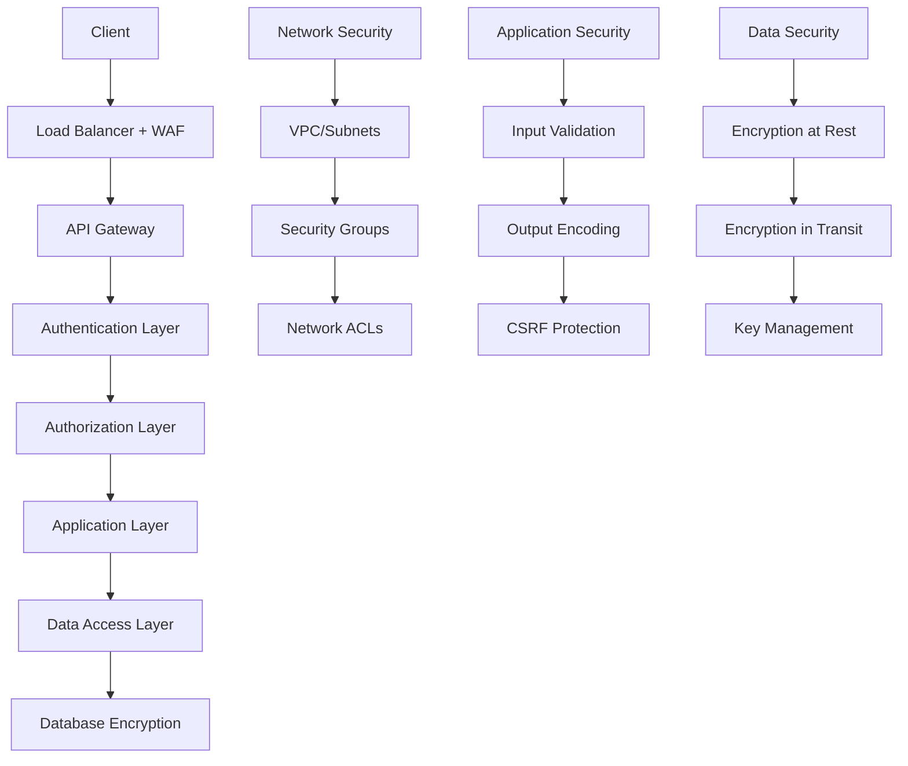

# Sécurité des Données - Django ETL Platform

## Vue d'ensemble

La sécurité des données est un aspect critique de la plateforme ETL, particulièrement lors du traitement de données sensibles ou personnelles. Ce document couvre les mesures de sécurité, le chiffrement, la conformité réglementaire et les bonnes pratiques.

## Architecture de sécurité

### Défense en profondeur



## Chiffrement et gestion des clés

### Chiffrement des credentials

```python
# security/encryption.py
import os
import base64
from cryptography.fernet import Fernet
from cryptography.hazmat.primitives import hashes
from cryptography.hazmat.primitives.kdf.pbkdf2 import PBKDF2HMAC
from django.conf import settings
from typing import Dict, Any
import json

class CredentialEncryption:
    """Gestionnaire de chiffrement pour les credentials."""
    
    def __init__(self):
        self._key = self._get_or_create_key()
        self._fernet = Fernet(self._key)
    
    def _get_or_create_key(self) -> bytes:
        """Récupère ou crée la clé de chiffrement."""
        # En production, cette clé doit venir d'un service sécurisé (AWS KMS, Azure Key Vault, etc.)
        master_key = os.getenv('ENCRYPTION_MASTER_KEY')
        if not master_key:
            raise ValueError("ENCRYPTION_MASTER_KEY environment variable is required")
        
        # Dériver une clé à partir du master key avec PBKDF2
        salt = os.getenv('ENCRYPTION_SALT', 'etl-platform-salt').encode()
        kdf = PBKDF2HMAC(
            algorithm=hashes.SHA256(),
            length=32,
            salt=salt,
            iterations=100000,
        )
        key = base64.urlsafe_b64encode(kdf.derive(master_key.encode()))
        return key
    
    def encrypt(self, data: Dict[str, Any]) -> str:
        """Chiffre un dictionnaire de données."""
        json_data = json.dumps(data, sort_keys=True)
        encrypted_data = self._fernet.encrypt(json_data.encode())
        return base64.urlsafe_b64encode(encrypted_data).decode()
    
    def decrypt(self, encrypted_data: str) -> Dict[str, Any]:
        """Déchiffre des données."""
        try:
            decoded_data = base64.urlsafe_b64decode(encrypted_data.encode())
            decrypted_data = self._fernet.decrypt(decoded_data)
            return json.loads(decrypted_data.decode())
        except Exception as e:
            raise ValueError(f"Failed to decrypt data: {str(e)}")
    
    def rotate_key(self, new_master_key: str) -> None:
        """Effectue une rotation de clé."""
        # Cette méthode doit être utilisée avec précaution
        # et nécessite une migration de toutes les données chiffrées
        old_fernet = self._fernet
        
        # Créer nouvelle clé
        salt = os.getenv('ENCRYPTION_SALT', 'etl-platform-salt').encode()
        kdf = PBKDF2HMAC(
            algorithm=hashes.SHA256(),
            length=32,
            salt=salt,
            iterations=100000,
        )
        new_key = base64.urlsafe_b64encode(kdf.derive(new_master_key.encode()))
        new_fernet = Fernet(new_key)
        
        # Planifier migration des données
        self._schedule_key_migration(old_fernet, new_fernet)

# Instance globale
credential_encryption = CredentialEncryption()
```

### Modèle de credentials sécurisé

```python
# models/security.py
from django.db import models
from django.core.exceptions import ValidationError
from security.encryption import credential_encryption
import uuid

class EncryptedCredential(models.Model):
    """Modèle pour stocker des credentials chiffrés."""
    
    id = models.UUIDField(primary_key=True, default=uuid.uuid4, editable=False)
    name = models.CharField(max_length=255)
    encrypted_data = models.TextField()
    created_at = models.DateTimeField(auto_now_add=True)
    updated_at = models.DateTimeField(auto_now=True)
    created_by = models.ForeignKey('auth.User', on_delete=models.PROTECT)
    last_accessed = models.DateTimeField(null=True, blank=True)
    access_count = models.PositiveIntegerField(default=0)
    
    # Audit et rotation
    key_version = models.PositiveIntegerField(default=1)
    expires_at = models.DateTimeField(null=True, blank=True)
    is_active = models.BooleanField(default=True)
    
    class Meta:
        db_table = 'encrypted_credentials'
        indexes = [
            models.Index(fields=['created_by', 'is_active']),
            models.Index(fields=['expires_at']),
        ]
    
    def encrypt_data(self, data: dict) -> None:
        """Chiffre et stocke les données."""
        # Validation des données sensibles
        self._validate_sensitive_data(data)
        
        # Chiffrement
        self.encrypted_data = credential_encryption.encrypt(data)
        
        # Audit
        self._log_encryption_event()
    
    def decrypt_data(self) -> dict:
        """Déchiffre et retourne les données."""
        if not self.is_active:
            raise ValidationError("Credential is not active")
        
        if self.expires_at and timezone.now() > self.expires_at:
            raise ValidationError("Credential has expired")
        
        # Déchiffrement
        data = credential_encryption.decrypt(self.encrypted_data)
        
        # Mise à jour des statistiques d'accès
        self._update_access_stats()
        
        return data
    
    def _validate_sensitive_data(self, data: dict) -> None:
        """Valide que les données sensibles sont conformes."""
        # Vérifier la présence de mots de passe faibles
        if 'password' in data:
            password = data['password']
            if len(password) < 8:
                raise ValidationError("Password too short")
            if password.lower() in ['password', '123456', 'admin']:
                raise ValidationError("Password too weak")
        
        # Vérifier les clés API
        if 'api_key' in data:
            api_key = data['api_key']
            if len(api_key) < 20:
                raise ValidationError("API key appears too short")
    
    def _update_access_stats(self) -> None:
        """Met à jour les statistiques d'accès."""
        from django.utils import timezone
        self.last_accessed = timezone.now()
        self.access_count += 1
        self.save(update_fields=['last_accessed', 'access_count'])
        
        # Log de l'accès pour audit
        self._log_access_event()
    
    def _log_encryption_event(self) -> None:
        """Log l'événement de chiffrement."""
        import logging
        audit_logger = logging.getLogger('audit')
        audit_logger.info(
            "Credential encrypted",
            extra={
                'credential_id': str(self.id),
                'user_id': str(self.created_by.id),
                'action': 'encrypt'
            }
        )
    
    def _log_access_event(self) -> None:
        """Log l'événement d'accès."""
        import logging
        audit_logger = logging.getLogger('audit')
        audit_logger.info(
            "Credential accessed",
            extra={
                'credential_id': str(self.id),
                'access_count': self.access_count,
                'action': 'decrypt'
            }
        )
```

## Authentification et autorisation

### Authentification multi-facteur

```python
# security/mfa.py
import pyotp
import qrcode
from io import BytesIO
import base64
from django.contrib.auth.models import User
from django.core.cache import cache
from typing import Optional

class MFAManager:
    """Gestionnaire d'authentification multi-facteur."""
    
    def generate_totp_secret(self, user: User) -> str:
        """Génère un secret TOTP pour un utilisateur."""
        secret = pyotp.random_base32()
        
        # Stocker temporairement le secret (avant validation)
        cache.set(f"mfa_setup:{user.id}", secret, timeout=300)  # 5 minutes
        
        return secret
    
    def generate_qr_code(self, user: User, secret: str) -> str:
        """Génère un QR code pour l'authentification TOTP."""
        provisioning_uri = pyotp.totp.TOTP(secret).provisioning_uri(
            user.email,
            issuer_name="ETL Platform"
        )
        
        # Créer le QR code
        qr = qrcode.QRCode(version=1, box_size=10, border=5)
        qr.add_data(provisioning_uri)
        qr.make(fit=True)
        
        img = qr.make_image(fill_color="black", back_color="white")
        
        # Convertir en base64
        buffer = BytesIO()
        img.save(buffer, format='PNG')
        img_str = base64.b64encode(buffer.getvalue()).decode()
        
        return f"data:image/png;base64,{img_str}"
    
    def verify_totp(self, user: User, token: str, secret: Optional[str] = None) -> bool:
        """Vérifie un token TOTP."""
        if secret is None:
            # Récupérer le secret stocké pour l'utilisateur
            profile = getattr(user, 'profile', None)
            if not profile or not profile.mfa_secret:
                return False
            secret = profile.mfa_secret
        
        totp = pyotp.TOTP(secret)
        
        # Vérifier le token avec une fenêtre de tolérance
        return totp.verify(token, valid_window=1)
    
    def enable_mfa(self, user: User, token: str) -> bool:
        """Active MFA pour un utilisateur après vérification."""
        # Récupérer le secret temporaire
        secret = cache.get(f"mfa_setup:{user.id}")
        if not secret:
            return False
        
        # Vérifier le token
        if not self.verify_totp(user, token, secret):
            return False
        
        # Sauvegarder le secret et activer MFA
        profile, created = UserProfile.objects.get_or_create(user=user)
        profile.mfa_secret = secret
        profile.mfa_enabled = True
        profile.save()
        
        # Nettoyer le cache
        cache.delete(f"mfa_setup:{user.id}")
        
        # Générer des codes de récupération
        self._generate_recovery_codes(user)
        
        return True
    
    def _generate_recovery_codes(self, user: User, count: int = 10) -> List[str]:
        """Génère des codes de récupération."""
        import secrets
        import string
        
        codes = []
        for _ in range(count):
            code = ''.join(secrets.choice(string.ascii_uppercase + string.digits) for _ in range(8))
            codes.append(code)
        
        # Stocker les codes chiffrés
        profile = user.profile
        profile.recovery_codes = credential_encryption.encrypt({'codes': codes})
        profile.save()
        
        return codes

# Middleware MFA
class MFAMiddleware:
    """Middleware pour enforcer MFA."""
    
    def __init__(self, get_response):
        self.get_response = get_response
        self.mfa_manager = MFAManager()
    
    def __call__(self, request):
        # Vérifier si MFA est requis
        if self._requires_mfa(request):
            if not self._is_mfa_verified(request):
                return self._redirect_to_mfa(request)
        
        response = self.get_response(request)
        return response
    
    def _requires_mfa(self, request) -> bool:
        """Détermine si MFA est requis pour cette requête."""
        if not request.user.is_authenticated:
            return False
        
        # MFA requis pour les actions sensibles
        sensitive_paths = [
            '/admin/',
            '/api/connectors/',
            '/api/credentials/',
        ]
        
        return any(request.path.startswith(path) for path in sensitive_paths)
    
    def _is_mfa_verified(self, request) -> bool:
        """Vérifie si MFA a été validé pour cette session."""
        return request.session.get('mfa_verified', False)
```

### Contrôle d'accès basé sur les rôles (RBAC)

```python
# security/rbac.py
from django.contrib.auth.models import Permission, Group
from django.contrib.contenttypes.models import ContentType
from enum import Enum
from typing import List, Set

class Role(Enum):
    """Rôles système."""
    ADMIN = "admin"
    DEVELOPER = "developer"
    ANALYST = "analyst"
    VIEWER = "viewer"

class PermissionManager:
    """Gestionnaire de permissions granulaires."""
    
    # Mapping des rôles vers les permissions
    ROLE_PERMISSIONS = {
        Role.ADMIN: {
            'pipeline': ['add', 'change', 'delete', 'view', 'execute'],
            'connector': ['add', 'change', 'delete', 'view', 'test'],
            'credential': ['add', 'change', 'delete', 'view'],
            'organization': ['change', 'view'],
            'user': ['add', 'change', 'view'],
        },
        Role.DEVELOPER: {
            'pipeline': ['add', 'change', 'view', 'execute'],
            'connector': ['add', 'change', 'view', 'test'],
            'credential': ['add', 'change', 'view'],
            'organization': ['view'],
        },
        Role.ANALYST: {
            'pipeline': ['view', 'execute'],
            'connector': ['view'],
            'organization': ['view'],
        },
        Role.VIEWER: {
            'pipeline': ['view'],
            'connector': ['view'],
            'organization': ['view'],
        }
    }
    
    def create_roles_and_permissions(self):
        """Crée les rôles et permissions dans la base."""
        for role in Role:
            group, created = Group.objects.get_or_create(name=role.value)
            
            if created:
                self._assign_permissions_to_group(group, role)
    
    def _assign_permissions_to_group(self, group: Group, role: Role):
        """Assigne les permissions à un groupe."""
        permissions_config = self.ROLE_PERMISSIONS.get(role, {})
        
        for model_name, actions in permissions_config.items():
            try:
                content_type = ContentType.objects.get(model=model_name)
                
                for action in actions:
                    permission_codename = f"{action}_{model_name}"
                    permission, created = Permission.objects.get_or_create(
                        codename=permission_codename,
                        content_type=content_type,
                        defaults={'name': f'Can {action} {model_name}'}
                    )
                    group.permissions.add(permission)
                    
            except ContentType.DoesNotExist:
                print(f"ContentType for {model_name} not found")
    
    def assign_role_to_user(self, user, role: Role, organization=None):
        """Assigne un rôle à un utilisateur."""
        group = Group.objects.get(name=role.value)
        user.groups.add(group)
        
        # Si contexte organisationnel
        if organization:
            OrganizationMembership.objects.update_or_create(
                user=user,
                organization=organization,
                defaults={'role': role.value}
            )
    
    def user_has_permission(self, user, permission: str, obj=None) -> bool:
        """Vérifie si un utilisateur a une permission."""
        # Vérifier permission Django standard
        if user.has_perm(permission, obj):
            return True
        
        # Vérifier permission organisationnelle
        if obj and hasattr(obj, 'organization'):
            membership = OrganizationMembership.objects.filter(
                user=user,
                organization=obj.organization
            ).first()
            
            if membership:
                return self._role_has_permission(Role(membership.role), permission)
        
        return False
    
    def _role_has_permission(self, role: Role, permission: str) -> bool:
        """Vérifie si un rôle a une permission."""
        permissions = self.ROLE_PERMISSIONS.get(role, {})
        
        # Parser la permission (ex: "add_pipeline" -> model="pipeline", action="add")
        try:
            action, model = permission.split('_', 1)
            return action in permissions.get(model, [])
        except ValueError:
            return False

# Decorator pour vérifier les permissions
def requires_permission(permission: str):
    """Decorator pour vérifier les permissions sur les vues."""
    def decorator(view_func):
        def wrapper(request, *args, **kwargs):
            if not request.user.is_authenticated:
                raise PermissionDenied("Authentication required")
            
            permission_manager = PermissionManager()
            
            # Récupérer l'objet si ID fourni
            obj = None
            if 'pk' in kwargs:
                # Essayer de récupérer l'objet pour vérification contextuelle
                try:
                    model_class = view_func.__self__.get_queryset().model
                    obj = model_class.objects.get(pk=kwargs['pk'])
                except:
                    pass
            
            if not permission_manager.user_has_permission(request.user, permission, obj):
                raise PermissionDenied(f"Permission denied: {permission}")
            
            return view_func(request, *args, **kwargs)
        
        return wrapper
    return decorator
```

## Audit et conformité

### Trail d'audit complet

```python
# security/audit.py
import logging
from django.db import models
from django.contrib.auth.models import User
from django.utils import timezone
from typing import Any, Dict, Optional
import json
import uuid

class AuditEvent(models.Model):
    """Modèle pour les événements d'audit."""
    
    ACTIONS = [
        ('create', 'Create'),
        ('read', 'Read'),
        ('update', 'Update'),
        ('delete', 'Delete'),
        ('execute', 'Execute'),
        ('login', 'Login'),
        ('logout', 'Logout'),
        ('access_denied', 'Access Denied'),
    ]
    
    id = models.UUIDField(primary_key=True, default=uuid.uuid4, editable=False)
    timestamp = models.DateTimeField(default=timezone.now)
    user = models.ForeignKey(User, on_delete=models.SET_NULL, null=True, blank=True)
    action = models.CharField(max_length=20, choices=ACTIONS)
    resource_type = models.CharField(max_length=50)
    resource_id = models.CharField(max_length=255, null=True, blank=True)
    details = models.JSONField(default=dict)
    ip_address = models.GenericIPAddressField(null=True, blank=True)
    user_agent = models.TextField(null=True, blank=True)
    session_key = models.CharField(max_length=40, null=True, blank=True)
    success = models.BooleanField(default=True)
    error_message = models.TextField(null=True, blank=True)
    
    class Meta:
        db_table = 'audit_events'
        indexes = [
            models.Index(fields=['timestamp', 'user']),
            models.Index(fields=['resource_type', 'resource_id']),
            models.Index(fields=['action', 'success']),
        ]
    
    def __str__(self):
        return f"{self.action} {self.resource_type} by {self.user} at {self.timestamp}"

class AuditLogger:
    """Logger d'audit centralisé."""
    
    def __init__(self):
        self.logger = logging.getLogger('audit')
    
    def log_event(
        self,
        action: str,
        resource_type: str,
        user: Optional[User] = None,
        resource_id: Optional[str] = None,
        details: Optional[Dict] = None,
        request=None,
        success: bool = True,
        error_message: Optional[str] = None
    ) -> AuditEvent:
        """Log un événement d'audit."""
        
        # Extraire info de la requête
        ip_address = None
        user_agent = None
        session_key = None
        
        if request:
            ip_address = self._get_client_ip(request)
            user_agent = request.META.get('HTTP_USER_AGENT', '')
            session_key = request.session.session_key
            if not user and request.user.is_authenticated:
                user = request.user
        
        # Créer l'événement d'audit
        audit_event = AuditEvent.objects.create(
            user=user,
            action=action,
            resource_type=resource_type,
            resource_id=resource_id,
            details=details or {},
            ip_address=ip_address,
            user_agent=user_agent,
            session_key=session_key,
            success=success,
            error_message=error_message
        )
        
        # Log structuré
        self.logger.info(
            f"Audit: {action} {resource_type}",
            extra={
                'audit_id': str(audit_event.id),
                'user_id': str(user.id) if user else None,
                'action': action,
                'resource_type': resource_type,
                'resource_id': resource_id,
                'success': success,
                'ip_address': ip_address,
                'details': details
            }
        )
        
        return audit_event
    
    def _get_client_ip(self, request) -> str:
        """Récupère l'IP du client."""
        x_forwarded_for = request.META.get('HTTP_X_FORWARDED_FOR')
        if x_forwarded_for:
            ip = x_forwarded_for.split(',')[0]
        else:
            ip = request.META.get('REMOTE_ADDR')
        return ip
    
    def log_pipeline_execution(self, pipeline, user, context, success=True, error=None):
        """Log spécifique pour l'exécution de pipeline."""
        details = {
            'pipeline_name': pipeline.name,
            'context': context,
            'organization': pipeline.organization.name
        }
        
        self.log_event(
            action='execute',
            resource_type='pipeline',
            resource_id=str(pipeline.id),
            user=user,
            details=details,
            success=success,
            error_message=str(error) if error else None
        )
    
    def log_data_access(self, connector, user, query, row_count, success=True, error=None):
        """Log spécifique pour l'accès aux données."""
        details = {
            'connector_name': connector.name,
            'connector_type': connector.connector_type,
            'query_hash': hashlib.sha256(query.encode()).hexdigest()[:16],
            'row_count': row_count
        }
        
        self.log_event(
            action='read',
            resource_type='data',
            resource_id=str(connector.id),
            user=user,
            details=details,
            success=success,
            error_message=str(error) if error else None
        )

# Signaux Django pour audit automatique
from django.db.models.signals import post_save, post_delete
from django.dispatch import receiver

audit_logger = AuditLogger()

@receiver(post_save, sender='pipelines.Pipeline')
def pipeline_audit(sender, instance, created, **kwargs):
    """Audit automatique des changements de pipeline."""
    action = 'create' if created else 'update'
    
    audit_logger.log_event(
        action=action,
        resource_type='pipeline',
        resource_id=str(instance.id),
        user=getattr(instance, '_current_user', None),
        details={
            'pipeline_name': instance.name,
            'organization': instance.organization.name,
            'status': instance.status
        }
    )

@receiver(post_delete, sender='pipelines.Pipeline')
def pipeline_delete_audit(sender, instance, **kwargs):
    """Audit de suppression de pipeline."""
    audit_logger.log_event(
        action='delete',
        resource_type='pipeline',
        resource_id=str(instance.id),
        user=getattr(instance, '_current_user', None),
        details={
            'pipeline_name': instance.name,
            'organization': instance.organization.name
        }
    )
```

### Conformité RGPD

```python
# security/gdpr.py
from django.db import models
from django.contrib.auth.models import User
from typing import List, Dict, Any
from datetime import datetime, timedelta
import json

class DataProcessingRecord(models.Model):
    """Registre des traitements de données pour RGPD."""
    
    PURPOSE_CHOICES = [
        ('analytics', 'Analytics'),
        ('reporting', 'Reporting'),
        ('integration', 'Data Integration'),
        ('backup', 'Backup'),
        ('monitoring', 'Monitoring'),
    ]
    
    LEGAL_BASIS_CHOICES = [
        ('consent', 'Consent'),
        ('contract', 'Contract'),
        ('legal_obligation', 'Legal Obligation'),
        ('legitimate_interest', 'Legitimate Interest'),
    ]
    
    id = models.UUIDField(primary_key=True, default=uuid.uuid4, editable=False)
    pipeline = models.ForeignKey('pipelines.Pipeline', on_delete=models.CASCADE)
    purpose = models.CharField(max_length=20, choices=PURPOSE_CHOICES)
    legal_basis = models.CharField(max_length=20, choices=LEGAL_BASIS_CHOICES)
    data_categories = models.JSONField(default=list)  # ['personal', 'financial', 'health']
    retention_period_days = models.PositiveIntegerField()
    automated_decision_making = models.BooleanField(default=False)
    third_party_transfers = models.JSONField(default=list)
    created_at = models.DateTimeField(auto_now_add=True)
    updated_at = models.DateTimeField(auto_now=True)
    
    class Meta:
        db_table = 'data_processing_records'

class PersonalDataInventory(models.Model):
    """Inventaire des données personnelles."""
    
    DATA_TYPES = [
        ('name', 'Name'),
        ('email', 'Email'),
        ('phone', 'Phone'),
        ('address', 'Address'),
        ('ip_address', 'IP Address'),
        ('user_id', 'User ID'),
        ('financial', 'Financial Data'),
        ('health', 'Health Data'),
        ('biometric', 'Biometric Data'),
    ]
    
    connector = models.ForeignKey('connectors.Connector', on_delete=models.CASCADE)
    table_name = models.CharField(max_length=255)
    column_name = models.CharField(max_length=255)
    data_type = models.CharField(max_length=20, choices=DATA_TYPES)
    is_sensitive = models.BooleanField(default=False)
    encryption_required = models.BooleanField(default=False)
    anonymization_method = models.CharField(max_length=100, blank=True)
    last_reviewed = models.DateTimeField(null=True, blank=True)
    
    class Meta:
        db_table = 'personal_data_inventory'
        unique_together = ['connector', 'table_name', 'column_name']

class GDPRManager:
    """Gestionnaire de conformité RGPD."""
    
    def generate_data_map(self, organization) -> Dict[str, Any]:
        """Génère une cartographie des données."""
        inventory = PersonalDataInventory.objects.filter(
            connector__organization=organization
        ).select_related('connector')
        
        data_map = {}
        for item in inventory:
            connector_name = item.connector.name
            if connector_name not in data_map:
                data_map[connector_name] = {
                    'connector_type': item.connector.connector_type,
                    'tables': {}
                }
            
            table_name = item.table_name
            if table_name not in data_map[connector_name]['tables']:
                data_map[connector_name]['tables'][table_name] = []
            
            data_map[connector_name]['tables'][table_name].append({
                'column': item.column_name,
                'data_type': item.data_type,
                'is_sensitive': item.is_sensitive,
                'encryption_required': item.encryption_required
            })
        
        return data_map
    
    def check_retention_compliance(self) -> List[Dict]:
        """Vérifie la conformité aux périodes de rétention."""
        violations = []
        
        records = DataProcessingRecord.objects.all()
        for record in records:
            # Vérifier si des données dépassent la période de rétention
            cutoff_date = datetime.now() - timedelta(days=record.retention_period_days)
            
            # Cette vérification devrait être adaptée selon la structure des données
            violations.extend(self._check_pipeline_retention(record, cutoff_date))
        
        return violations
    
    def anonymize_data(self, data: Dict[str, Any], anonymization_rules: Dict[str, str]) -> Dict[str, Any]:
        """Anonymise les données selon les règles définies."""
        anonymized_data = data.copy()
        
        for field, method in anonymization_rules.items():
            if field in anonymized_data:
                if method == 'hash':
                    anonymized_data[field] = self._hash_value(str(anonymized_data[field]))
                elif method == 'remove':
                    del anonymized_data[field]
                elif method == 'generalize':
                    anonymized_data[field] = self._generalize_value(anonymized_data[field])
                elif method == 'mask':
                    anonymized_data[field] = self._mask_value(str(anonymized_data[field]))
        
        return anonymized_data
    
    def _hash_value(self, value: str) -> str:
        """Hash une valeur de façon irréversible."""
        import hashlib
        return hashlib.sha256(value.encode()).hexdigest()
    
    def _generalize_value(self, value):
        """Généralise une valeur (ex: âge exact -> tranche d'âge)."""
        if isinstance(value, int) and 0 <= value <= 120:  # âge
            if value < 18:
                return "minor"
            elif value < 65:
                return "adult"
            else:
                return "senior"
        return "unknown"
    
    def _mask_value(self, value: str) -> str:
        """Masque partiellement une valeur."""
        if '@' in value:  # email
            local, domain = value.split('@', 1)
            return f"{local[0]}***@{domain}"
        elif len(value) > 4:  # autre texte
            return f"{value[:2]}***{value[-2:]}"
        else:
            return "***"
    
    def generate_privacy_report(self, organization) -> Dict[str, Any]:
        """Génère un rapport de confidentialité."""
        data_map = self.generate_data_map(organization)
        retention_violations = self.check_retention_compliance()
        
        # Compter les types de données
        data_types_count = {}
        sensitive_data_count = 0
        
        for connector_data in data_map.values():
            for table_data in connector_data['tables'].values():
                for column in table_data:
                    data_type = column['data_type']
                    data_types_count[data_type] = data_types_count.get(data_type, 0) + 1
                    if column['is_sensitive']:
                        sensitive_data_count += 1
        
        return {
            'organization': organization.name,
            'generated_at': datetime.now().isoformat(),
            'data_map': data_map,
            'data_types_summary': data_types_count,
            'sensitive_data_fields': sensitive_data_count,
            'retention_violations': len(retention_violations),
            'compliance_score': self._calculate_compliance_score(data_map, retention_violations)
        }
    
    def _calculate_compliance_score(self, data_map: Dict, violations: List) -> float:
        """Calcule un score de conformité."""
        total_fields = sum(
            len(table_data) 
            for connector_data in data_map.values() 
            for table_data in connector_data['tables'].values()
        )
        
        if total_fields == 0:
            return 1.0
        
        # Pénalité pour les violations
        violation_penalty = len(violations) * 0.1
        
        # Score basé sur le ratio violations/total
        base_score = max(0, 1.0 - (len(violations) / total_fields))
        
        return max(0, base_score - violation_penalty)
```

## Sécurité réseau et infrastructure

### Configuration sécurisée

```yaml
# security/network-policies.yaml
apiVersion: networking.k8s.io/v1
kind: NetworkPolicy
metadata:
  name: etl-platform-security-policy
  namespace: etl-platform
spec:
  podSelector: {}
  policyTypes:
  - Ingress
  - Egress
  
  # Règles d'entrée
  ingress:
  - from:
    - namespaceSelector:
        matchLabels:
          name: ingress-nginx
    ports:
    - protocol: TCP
      port: 8000
  
  # Communication inter-services
  - from:
    - podSelector:
        matchLabels:
          app: django-app
    ports:
    - protocol: TCP
      port: 5432  # PostgreSQL
    - protocol: TCP
      port: 6379  # Redis
  
  # Règles de sortie
  egress:
  # DNS
  - to: []
    ports:
    - protocol: UDP
      port: 53
    - protocol: TCP
      port: 53
  
  # Services externes autorisés
  - to: []
    ports:
    - protocol: TCP
      port: 443  # HTTPS
    - protocol: TCP
      port: 80   # HTTP (seulement si nécessaire)

---
# Pod Security Standards
apiVersion: v1
kind: Namespace
metadata:
  name: etl-platform
  labels:
    pod-security.kubernetes.io/enforce: restricted
    pod-security.kubernetes.io/audit: restricted
    pod-security.kubernetes.io/warn: restricted
```

### Secrets et configuration sécurisée

```yaml
# security/sealed-secrets.yaml
apiVersion: bitnami.com/v1alpha1
kind: SealedSecret
metadata:
  name: etl-platform-secrets
  namespace: etl-platform
spec:
  encryptedData:
    SECRET_KEY: AgBy3i4OJSWK+PiTySYZZA9rO43cGDEQAx...
    DATABASE_URL: AgBy3i4OJSWK+PiTySYZZA9rO43cGDEQAx...
    ENCRYPTION_MASTER_KEY: AgBy3i4OJSWK+PiTySYZZA9rO43cGDEQAx...
  template:
    metadata:
      name: etl-platform-secrets
      namespace: etl-platform
    type: Opaque
```

Cette approche de sécurité multicouche garantit la protection des données sensibles et la conformité réglementaire de la plateforme ETL.
